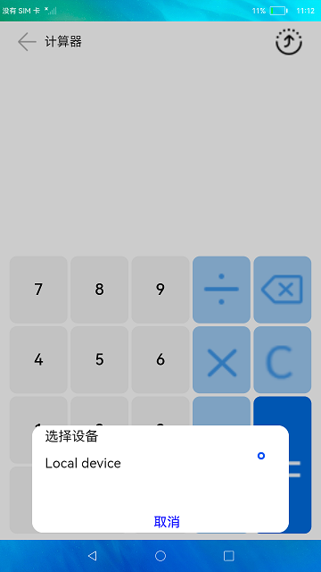

# 分布式计算器

### 简介

本示例使用JS分布式能力实现了一个简单的计算器应用，可以进行简单的数值计算，支持远程拉起另一个计算器FA，两个FA进行协同计算。

1.远程拉起：通过StartAbility实现远端应用的拉起。

2.协同计算：通过DistributedDataKit分布式数据框架实现异端应用的数据同步。

实现效果如下：

### 相关概念

-  分布式数据服务：分布式数据服务（Distributed Data Service，DDS） 为应用程序提供不同设备间数据库的分布式协同能力。通过调用分布式数据接口，应用程序将数据保存到分布式数据库中。通过结合帐号、应用和数据库三元组，分布式数据服务对属于不同应用的数据进行隔离，保证不同应用之间的数据不能通过分布式数据服务互相访问。在通过可信认证的设备间，分布式数据服务支持应用数据相互同步，为用户提供在多种终端设备上最终一致的数据访问体验。

### 相关权限

不涉及

### 使用说明

1.点击桌面应用图标，启动应用。

2.点击应用右上角按钮，或者在界面任意位置滑动（上下左右滑动皆可）即可弹出设备选择框。

3.在设备选择框中点击对端设备名称，拉起对端应用。

4.对端应用启动后，可在任意一端中操作应用，两端应用可实现数据实时同步。

5.在设备选择框中选中本机即可关闭对端应用。

### 约束与限制

1.本示例仅支持在标准系统上运行。

2.工程编译前需要在Terminal窗口，进入entry目录，再执行npm install mathjs --save。

3.本示例只实现简单的加减乘除功能，后续开发者可基于当前框架考虑在calc页面中实现更多的功能，如开方、立方、三角函数等科学计算功能。

4.分布式计算功能使用的前提是分布式组网。

5.本示例需要使用DevEco Studio 3.0 Beta3 (Build Version: 3.0.0.901, built on May 30, 2022)才可编译运行。